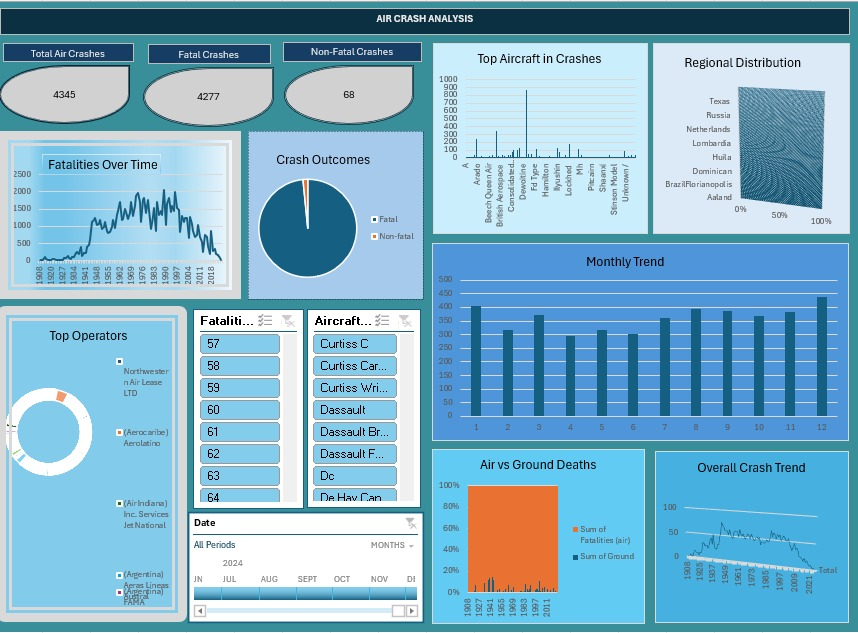

# ✈️ Air Crash Analysis Project (1908–2024)

##  Overview
This project presents an **Excel-based data analysis and visualization** of global air crash incidents recorded between **1908 and 2024**.  
The analysis was conducted using data obtained from the Kaggle dataset titled **"Air Crashes Full Data (1908–2023)"**.  
It includes comprehensive **data cleaning**, **trend analysis**, and an **interactive Excel dashboard** to visualize patterns in crash occurrences, aircraft manufacturers, and fatalities over time.

---

##  Project Files

| File Name | Description |
|------------|-------------|
| **excel project.xlsx** | Cleaned dataset and Excel dashboard with slicers for Year, Manufacturer, and Country. |
| **Air Crash Analysis Report(excel project).docx** | Full project report summarizing methodology, findings, and recommendations. |

---

##  Data Cleaning & Preparation

The dataset originally contained over **5,000 records**, which were refined through several data cleaning steps:

1. **Correction of Misspellings** — Standardized inconsistent text (e.g., country and manufacturer names).  
2. **Filtering Out Invalid Entries** — Removed misplaced or irrelevant data.  
3. **Trimming and Cleaning Text Fields** — Applied Excel’s `TRIM()` and `CLEAN()` functions.  
4. **Date Validation** — Ensured all records had properly formatted dates.  
5. **Duplicate Removal** — Verified dataset integrity (no duplicates found).  
6. **Merged Columns** — Combined Year, Month, and Day into a unified Date column.  

**Final dataset:** 4,347 valid and consistent records.

---

##  Dashboard Highlights

The interactive Excel dashboard includes the following key visuals:

- ** Monthly Trend** — Clustered column chart showing crash frequency over time.  
- ** Regional Distribution** — Stacked bar chart of crashes by country/region.  
- ** Crashes by Aircraft Type** — Comparison of top aircraft manufacturers involved.  
- ** Fatalities Over Time** — Yearly trend of fatalities (air + ground).

Each visualization includes slicers for **Year**, **Country**, and **Manufacturer** to allow flexible exploration.
##  Dashboard Snapshot

Below is a preview of the interactive Excel dashboard created for this project:

  

> 💡 *The dashboard displays crash trends, top affected countries, aircraft manufacturers, and fatalities over time.*

---

##  Key Findings

- **Peak crash periods:** Mid-20th century, with a steady decline in modern decades.  
- **Top Countries:** Russia (249), Brazil (164), Colombia (148), France (123), India (98).  
- **Top Manufacturers:** Douglas (871), Boeing (340), Antonov (247), Lockheed (177), De Havilland Canada (134).  
- **Fatalities:** Higher in early decades, decreasing with technological and regulatory improvements.  

---

##  Insights & Recommendations

1. Standardize manufacturer and operator labels for improved comparability.  
2. Incorporate cause categories (e.g., human error, weather, mechanical failure) for deeper insights.  
3. Prioritize maintenance and pilot training in high-risk regions.  
4. Update the dataset annually to monitor ongoing safety trends.

---

##  Project Summary

| Item | Details |
|------|----------|
| **Data Source** | Kaggle – Air Crashes Full Data (1908–2023) |
| **Tool Used** | Microsoft Excel |
| **Records Analyzed** | 4,347 |
| **Course Project** | Excel Data Analysis & Dashboard |
| **Author** | Angel Okoye |
| **Date** | October 2025 |

---

##  References
- Kaggle Dataset — [Air Crashes Full Data (1908–2023)](https://www.kaggle.com/datasets)
- Excel Project Assignment Brief (2025)

---

## Summary
This analysis highlights over a century of aviation safety evolution, emphasizing how data-driven insights can guide **safer flight operations**, **policy formulation**, and **risk mitigation** in the aviation industry.

---

✍️ **Author:** Angel Okoye  
📅 **Date:** October 2025  
📂 **Repository:** `Air-Crash-Analysis-Project`

